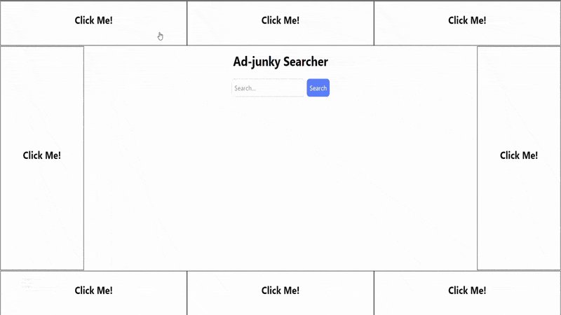

## Read in Other Languages  
- [Português (pt-br)](README_PT-BR.md) 

# Smart Hide Chrome Extension  

Welcome to **Smart Hide**, an open-source Chrome extension that lets you manually hide unwanted elements on any webpage—and remembers your preferences for future visits!  

Whether it’s distracting ads, annoying pop-ups, or anything else cluttering your screen, Smart Hide helps you declutter and focus on what matters.  

## How to Install  

Since this is an open-source project, you’ll need to manually download and enable the extension in Chrome. Don’t worry—it’s easy! Here’s how:  

1. **Download the Latest Release**  
   - Go to the [Releases page](https://github.com/eliasfeijo/smart-hide-chrome-ext/releases) of this repository.  
   - Download the latest `.zip` file under "Assets."  

2. **Extract the Files**  
   - Unzip the downloaded file to a folder on your computer.  

3. **Enable Developer Mode in Chrome**  
   - Open Chrome and go to `chrome://extensions/`.  
   - Toggle the **Developer mode** switch on (located in the top-right corner).  

4. **Load the Extension**  
   - Click the **Load unpacked** button.  
   - Select the folder where you extracted the files.  

That’s it! The Smart Hide extension should now be installed and ready to use.  

## How to Use  

1. Ensure that the Smart Hide extension is correctly installed (the extension's icon should be visible and clickable in your Chrome's toolbar).  
2. Right-click the element you want to hide on the screen, and it should open the context menu that includes the option "Smart Hide."  
3. You can select one out of three options:  
   - **Hide**: One-click simple hide.  
   - **Smart Hide**: Advanced hide with additional options.  
   - **Remove**: One-click removal of the element from the HTML document.  

Check out the **Features** section below for more information on each of these optio

## Features

**WIP**

## Contributing  

This project is open-source, and contributions are welcome! If you have ideas for improvements or want to report a bug, please open an issue or submit a pull request.  

## License  

This project is licensed under the MIT License. See the [LICENSE](LICENSE) file for details.
