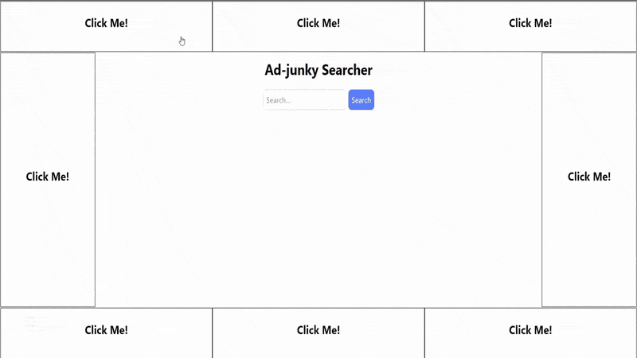

## Leia em Outros Idiomas  
- [English (Original)](README.md) 

# Smart Hide - Extensão para Chrome 

Bem-vindo ao **Smart Hide**, uma extensão open-source para Chrome que permite esconder manualmente elementos indesejados em qualquer página da web—e lembra das suas preferências nas próximas visitas!  

Seja para remover anúncios, pop-ups chatos ou qualquer outro elemento que atrapalhe sua experiência, o Smart Hide ajuda você a focar no que importa.  

## Como Instalar  

Como este é um projeto open-source, você precisará baixar e habilitar a extensão manualmente no Chrome. Não se preocupe—é simples! Siga os passos abaixo:  

1. **Baixe a Última Versão**  
   - Acesse a página de [Releases](https://github.com/eliasfeijo/smart-hide-chrome-ext/releases) deste repositório.  
   - Baixe o arquivo `.zip` mais recente na seção "Assets."  

2. **Extraia os Arquivos**  
   - Extraia o arquivo baixado para uma pasta no seu computador.  

3. **Ative o Modo Desenvolvedor no Chrome**  
   - Abra o Chrome e acesse `chrome://extensions/`.  
   - Ative o **Modo Desenvolvedor** (no canto superior direito).  

4. **Carregue a Extensão**  
   - Clique no botão **Carregar sem compactação**.  
   - Selecione a pasta onde você extraiu os arquivos.  

Pronto! A extensão Smart Hide estará instalada e pronta para uso.  

## Como Usar  

1. Clique no ícone do Smart Hide na barra de ferramentas do Chrome para ativá-lo.  
2. Clique em qualquer elemento da página que você deseja esconder.  
3. O elemento desaparecerá instantaneamente—e continuará escondido mesmo quando você revisitá-la!  

## Contribuindo  

Este projeto é open-source, e contribuições são bem-vindas! Se você tem ideias para melhorias ou quer reportar um bug, sinta-se à vontade para abrir uma *issue* ou enviar um *pull request*.  

## Licença  

Este projeto está licenciado sob a MIT License. Consulte o arquivo [LICENSE](LICENSE) para mais detalhes.  
